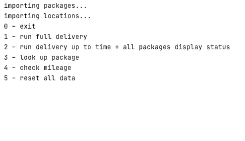
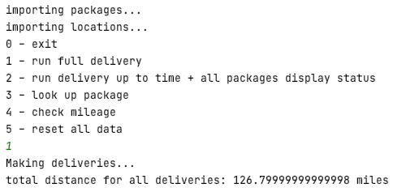
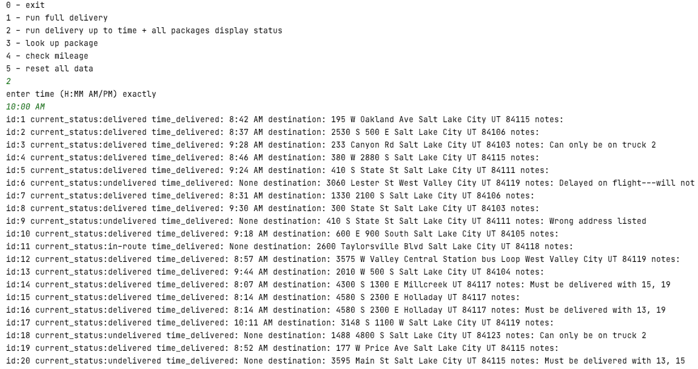
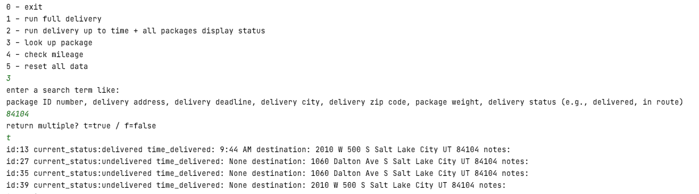
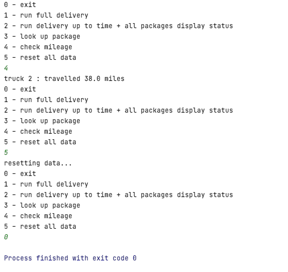

# School Project: Package Delivery Routing
### May 2020 | Python | Data Structures & Algorithms
## Project Purpose
The goal of this class project was to create a lightweight package delivery simulation. It required only a text based 
user interface to demonstrate specific outcomes. The delivery algorithm should optimize the packing of the trucks, and 
the delivery route to minimize the distance travelled. 

## Learning Outcomes

* Learned to create hashtable data structure from scratch.
* Created a somewhat efficient routing algorithm.
* Worked to calculate the program and algorithm complexity.

## Interface
A very basic command interface, it has a set of commands based on selecting numbers 0 to 5 and hitting return.

Running command 1 will run the full simulation. Delivering all packages and then outputting the total distance travelled.

Command 2 will take the input of a time, and run the simulation up until that time then stop, then it will output the 
status of every package in the system. 

Command 3 is a search function that takes many of the different data points as inputs, and returns the selection of
packages that have those data points.

Command 4 checks the mileage of the current truck. When running the partial simulation, it will show only the 
travel distance so far. During the full simulation it will just show the final travel distance. Command 5 resets 
the simulation. Command 0 exits the simulation.

## Installation
Create a new Pycharm project with at least a Python 3.6 version interpreter. Unzip the project files into the new empty 
project then run the files.

## License

No license for this work. 

